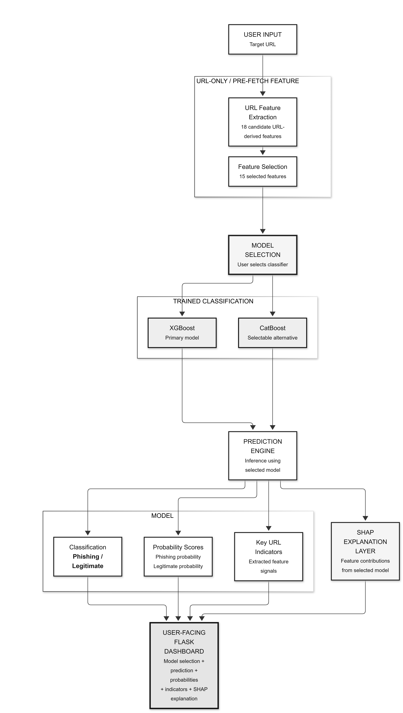

# AI-Based Phishing URL Detection

An academic machine-learning prototype that analyzes URL characteristics to estimate whether a link is phishing or legitimate. It combines feature engineering, XGBoost and CatBoost model comparison, SHAP explanations, and a Flask dashboard.

## Project Purpose

Phishing links are often crafted to resemble trusted websites or disguise their destinations. Assessing a link before opening it can help users make more informed decisions while reducing exposure to potentially harmful content.

This project goes beyond a simple static blacklist lookup. It uses supervised machine learning to identify patterns across measurable URL characteristics, selects informative features, and compares two gradient-boosted models. It is an inspectable academic and research prototype, not a replacement for a browser security product or security review.

## Strengths

- **Pre-fetch analysis:** Features are calculated from the submitted URL. The application does not connect to the destination, reducing the risk of interacting with a malicious site during analysis.
- **Consistent training and inference:** The same URL feature extraction logic is used for dataset preparation and dashboard predictions, avoiding reliance on webpage attributes unavailable at prediction time.
- **Model comparison:** XGBoost and CatBoost are evaluated on a stratified holdout set. Selection prioritizes phishing-class F1 score, then phishing recall.
- **Focused feature selection:** ANOVA-based `SelectKBest` selects up to 15 URL features using the training split.
- **Explainability:** SHAP provides feature-level context when a compatible explainer is available. Evaluation and feature artifacts are also saved for inspection.
- **Reproducible evaluation:** Training records accuracy, precision, recall, F1, model selection, and a confusion matrix. Use actual training output for performance claims.
- **Interactive dashboard:** A Flask interface accepts a URL and presents the model's assessment without opening the destination.

These predictions are estimates, not proof. A phishing URL may evade detection, and a legitimate URL may be flagged. Do not use a prediction as the sole basis for a security decision.

## How It Works

1. The training pipeline loads the PhiUSIIL dataset and validates its URL and label fields.
2. URL strings are transformed into URL-only characteristics, such as length, subdomain count, HTTPS usage, IP-address hosts, and encoded or unusual characters.
3. A stratified train/test split is created. Feature selection is fitted on training data, then XGBoost and CatBoost are trained and evaluated.
4. The model with the highest phishing-class F1 score (then recall) is saved with its selector and metadata.
5. The dashboard extracts the same features from a submitted URL and returns the model's prediction and available explanation.

The dataset uses label `0` for phishing and label `1` for legitimate URLs. The reported phishing probability is a model estimate, not a verified measure of real-world risk.

## Architecture




## Project Structure

```text
phishing_ai_project/
├── app.py                 # Flask dashboard and API
├── config.py              # Dataset, model, and artifact paths
├── requirements.txt       # Python dependencies
├── architecture.png       # Add the architecture diagram here
├── data/                  # Dataset CSV
├── models/                # Trained model bundle
├── artifacts/             # Metrics, selected features, and explanations
├── scripts/               # Dataset download and model training commands
├── src/                   # Feature extraction, training, evaluation, inference
├── templates/             # Dashboard HTML
├── static/                # Dashboard CSS and JavaScript
└── tests/                 # Feature extraction tests
```

## Dataset

This project uses the [PhiUSIIL Phishing URL (Website) Dataset](https://archive.ics.uci.edu/dataset/967/phiusil-phishing-url-dataset) from the UCI Machine Learning Repository (dataset ID 967). The original dataset includes URL-derived and webpage-derived attributes. This implementation uses URL-derived data only, because webpage fields cannot be recreated from a URL without visiting the destination.

The expected CSV path is `data/PhiUSIIL_Phishing_URL_Dataset.csv`. Download it using the provided script or obtain it from UCI and place it at that path.

## Setup and Use

### Requirements

Python 3.10 or later is recommended. Internet access is required to download the dataset. Training on the full dataset requires sufficient disk space and memory.

### 1. Create an environment and install dependencies

From the project root, create and activate a virtual environment and install dependencies. In PowerShell:

```powershell
python -m venv .venv
.venv\Scripts\Activate.ps1
python -m pip install --upgrade pip
pip install -r requirements.txt
```

If PowerShell blocks activation, use Command Prompt and run `.venv\Scripts\activate.bat`, or invoke `.venv\Scripts\python.exe` directly.

### 2. Obtain the dataset

Download through the UCI `ucimlrepo` package:

```powershell
python scripts/download_dataset.py
```

Alternatively, place the official CSV at `data/PhiUSIIL_Phishing_URL_Dataset.csv`.

### 3. Train and evaluate the models

```powershell
python scripts/run_training.py
```

Training saves the model bundle to `models/phishing_model.joblib` and evaluation outputs, including metrics and selected features, to `artifacts/`. Use generated artifacts for reported performance results; do not assume or invent metrics before training.

### 4. Run the dashboard

```powershell
python app.py
```

Open [http://127.0.0.1:5000](http://127.0.0.1:5000) in a browser. A trained model must exist before URL predictions are available.

### Run tests

```powershell
python -m pytest
```

## Scope and Safety

This URL-only classifier does not inspect page content, redirects, certificates, DNS records, or live reputation feeds. It may miss threats whose signals are not visible in the URL, and it cannot guarantee that a link is safe. Do not modify the application to browse arbitrary submitted URLs on a regular workstation; phishing pages may contain malicious content.

## Author

**Vikas Narlakanti**

[vikassagar891@gmail.com](mailto:vikassagar891@gmail.com)
